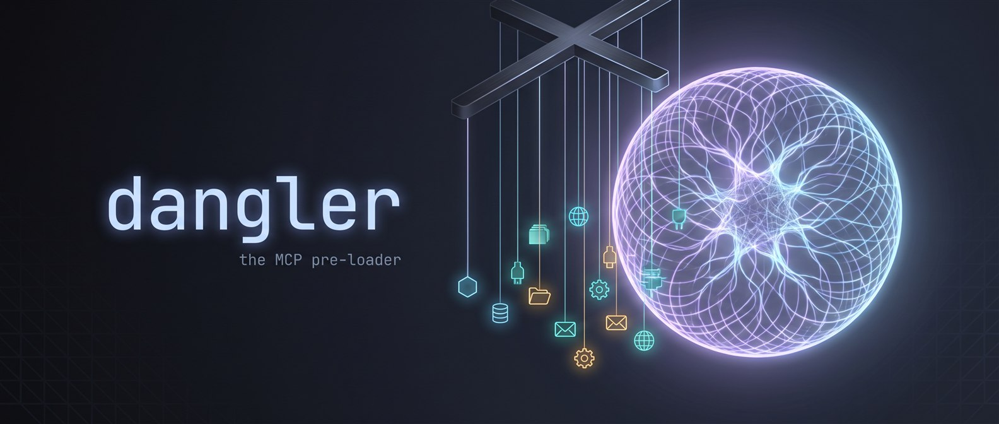
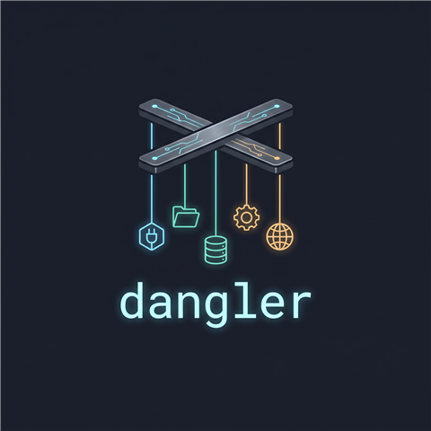

<p align="center">
  
</p>

<p align="center">
  <a href="https://github.com/ophiocus/dangler/actions/workflows/ci.yml"></a>
  
  <a href="LICENSE"></a>
</p>

**Dangler is an MCP pre-loader.** It sits between an MCP client (Claude Code, Claude
Desktop, anything that speaks stdio MCP) and a fleet of MCP servers, and *dangles* their
tools in front of the model — advertising what's available without paying for any of it
until it's actually used.

## Why

Every MCP server you register costs you twice before you've called a single tool:

1. **Context** — every tool schema from every server is injected into the model's context
   up front. Ten servers × thirty tools each and you've burned thousands of tokens on
   schemas the conversation will never touch.
2. **Processes** — stdio servers are spawned at client startup and sit resident whether
   used or not.

Dangler replaces all of that with **one** registration and five small meta-tools. The
model discovers capability on demand, downstream servers spawn on first touch, and idle
ones are reaped automatically.

| Meta-tool | What it does |
|---|---|
| `list_servers` | The configured fleet: name, warm/cold status, cached tool count |
| `search_tools {query}` | Search tool names/descriptions across the fleet's cached schemas |
| `load_server {name}` | Spawn the server if cold, return its full tool schemas — *the dangle* |
| `call_tool {server, tool, arguments}` | Proxy a call to a downstream tool (lazy-spawns) |
| `drop_server {name}` | Reap a downstream server's process now |

## Quick start

```bash
git clone https://github.com/ophiocus/dangler.git
cd dangler
cargo build --release
```

Describe your fleet in `dangler.toml` (start from
[dangler.example.toml](dangler.example.toml)):

```toml
idle_timeout_secs = 600            # reap warm children after 10 min unused (0 = never)

[servers.everything]               # the MCP reference server — good first smoke test
command = "npx"
args = ["-y", "@modelcontextprotocol/server-everything"]

[servers.mongodb]
command = "npx"
args = ["-y", "mongodb-mcp-server@latest", "--readOnly"]
[servers.mongodb.env]
MDB_MCP_CONNECTION_STRING = "mongodb+srv://…"
```

> ⚠️ `dangler.toml` tends to accumulate credentials (connection strings, tokens) —
> keep it out of version control. This repo gitignores it.

Then register dangler as the *only* MCP server your client needs:

```bash
claude mcp add dangler -e DANGLER_CONFIG=/path/to/dangler.toml -- /path/to/dangler
```

Optionally pre-index the whole fleet so `search_tools` works before anything has spawned:

```bash
dangler warm    # spawns each server once, harvests schemas into ~/.dangler/cache.json, reaps
```

## How it works

```
                upstream (one registration)         downstream (the fleet, lazy)
┌────────────┐   MCP over stdio           ┌─────────┐   spawn on first touch
│ MCP client │ ─────────────────────────▶ │ dangler │ ───▶ mongodb-mcp-server
│  (Claude)  │ ◀───────────────────────── │         │ ───▶ any stdio MCP server
└────────────┘   5 meta-tools, tiny schema└─────────┘ ───▶ …reaped when idle
```

Dangler is an MCP **server and client at once** (built on the official Rust SDK,
[`rmcp`](https://crates.io/crates/rmcp)). Schemas harvested from each server persist in
`~/.dangler/cache.json`, so cross-fleet search works from a cold start; idle children are
reaped on a 30-second scan (per-server `idle_timeout_secs` override; in-flight requests
are never interrupted). Design details, battle-scars, and the roadmap live in
[docs/architecture.md](docs/architecture.md).

### Windows without Node?

Servers can be launched through any bridge command. Example — running a Node-based MCP
server inside WSL from a Windows host (env vars cross via `WSLENV`):

```toml
[servers.mongodb]
command = "wsl"
args = ["-d", "Ubuntu-24.04", "--", "bash", "-lc", "npx -y mongodb-mcp-server@latest --readOnly"]
[servers.mongodb.env]
MDB_MCP_CONNECTION_STRING = "mongodb+srv://…"
WSLENV = "MDB_MCP_CONNECTION_STRING"
```

## Current limits

- **Stdio upstream only** — register it in Claude Code/Desktop or any stdio MCP client;
  no Streamable HTTP endpoint yet, so it can't be a claude.ai custom connector.
- **Stdio downstream only** — it fronts local child-process servers; hosted/HTTP MCP
  servers (OAuth connectors) can't be proxied yet.
- Schema search is cached-substring, not semantic; run `dangler warm` after changing the
  fleet so search sees everything.

All three are on the [roadmap](docs/architecture.md#roadmap-v0--useful).

## License

[MIT](LICENSE) © Carlos Santana

<p align="center">
  
</p>
